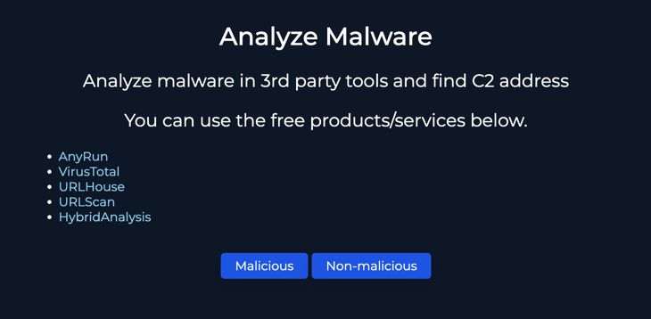

#### Intro
We received an alert from our security system about a malicious file download attempt. 

#### Alert Details
    EventID: 76
    EventTime: Mar, 14, 2021, 07:15 PM
    Rule: SOC137 - Malicious File/Script Download Attempt
    Level: Security Analyst
    Source Address: 172.16.17.37
    Source Hostname: NicolasPRD
    File Name: INVOICE PACKAGE LINK TO DOWNLOAD.docm
    File Hash: f2d0c66b801244c059f636d08a474079
    File Size: 16.66Kb
    Device Action: Blocked

#### Analysis

- Create Case

- Start Playbook

- Define Threat Indicator

  `other`

- Check if the malware is quarantined/cleaned 
  - For this, we must review the logs and endpoints.
  - Upon reviewing the alert again, we can see that the device action was blocked. So we can assume that the malware wasn't quarantined/cleaned.

  `not quarantined/cleaned`

- Analyze malware and find C2 addresses  `malicious`

  - For this we will start by utilizing VirusTotal and the file hash
  - Upon searching the file hash in VirusTotal, we can see that the file is malicious and has a detection ratio of 41/65. 

  - The malware attempts to contact the following IP addresses `C2 Addresses: 104.21.13.139, 172.67.200.96, 178.175.67.109, 188.114.96.0, 188.114.97.0, 204.79.197.203, 23.0.175.176, 23.0.175.209, 23.211.118.195, 23.211.118.41` 

- Check if Someone Requested the C2
  - Lets Check the Log Files
  - After reviewing the logs, it looks like no one has requested the C2 IP addresses.
`not accessed`

- Add Artifacts
  - Add the C2 addresses as artifacts

- Analyst Note 
  - A security alert was triggered for a malicious file download attempt on March 14, 2021, at 7:15 PM. The attempt originated from the source address 172.16.17.37, linked to the hostname NicolasPRD. The file in question, identified as "INVOICE PACKAGE LINK TO DOWNLOAD.docm", was blocked by the system, preventing execution. However, the file was determined to be malicious based on VirusTotal analysis, and a detection ratio of 41/65 further confirmed its threat potential.

#### Conclusion
- Finish the playbook
- Close the alert
  - `true positive`
- Score: 
